## 安装RSSHUB

Github 地址：https://github.com/DIYgod/RSSHub

官方文档: https://docs.rsshub.app/

1. 在群晖中打开 Docker->**注册表**中找到 rsshub，双击第一个 diygod/rsshub 进行安装。

   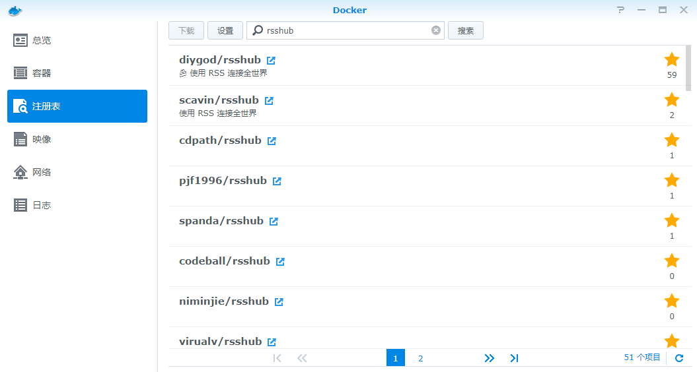

2. 安装完成后，在**映像**中选中安装完成的 rsshub 然后点击启动。

   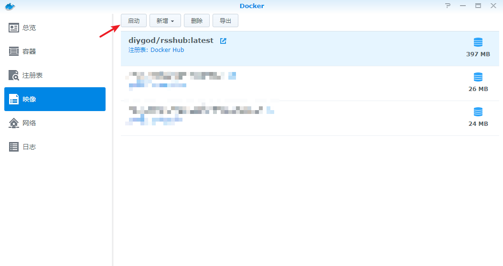

3. 自定义**容器名称**，然后选择**高级设置**。

   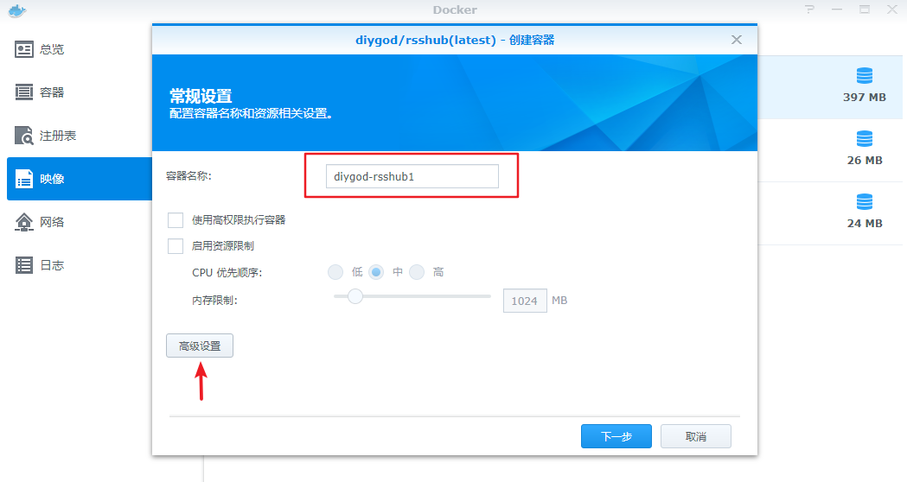

4. 在**端口设置**中修改本地端口。

   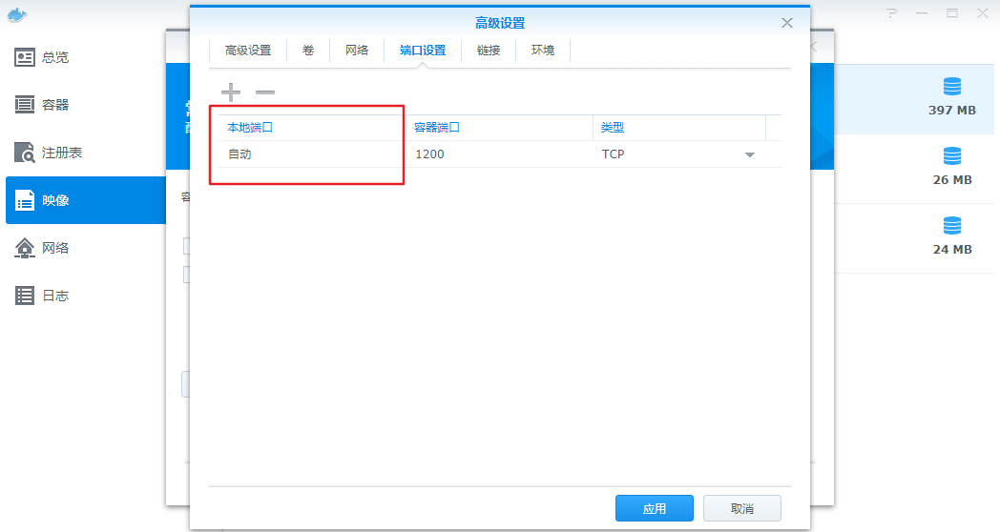

5. 点击应用并下一步至完成。

   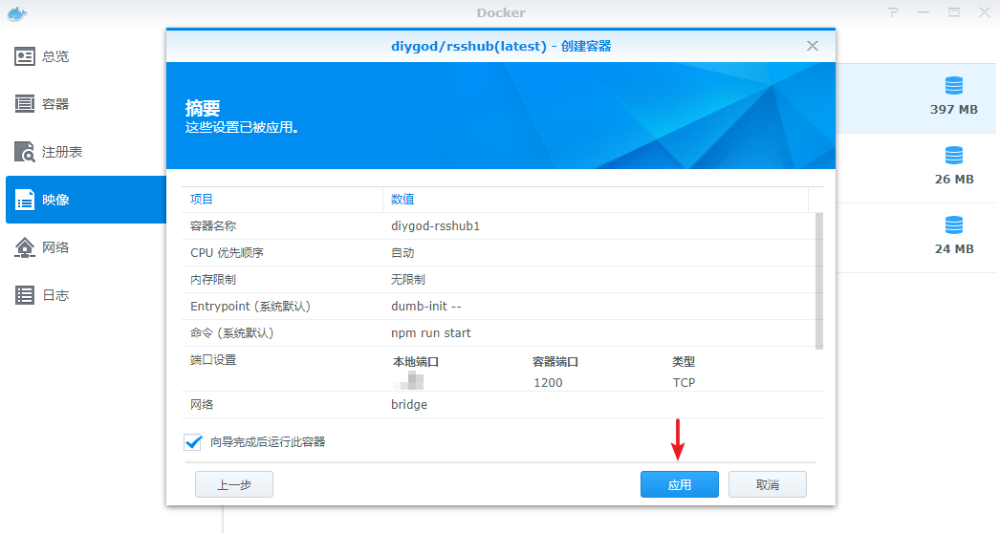

6. 在容器中可以看到 RSSHub 显示正常运行。

   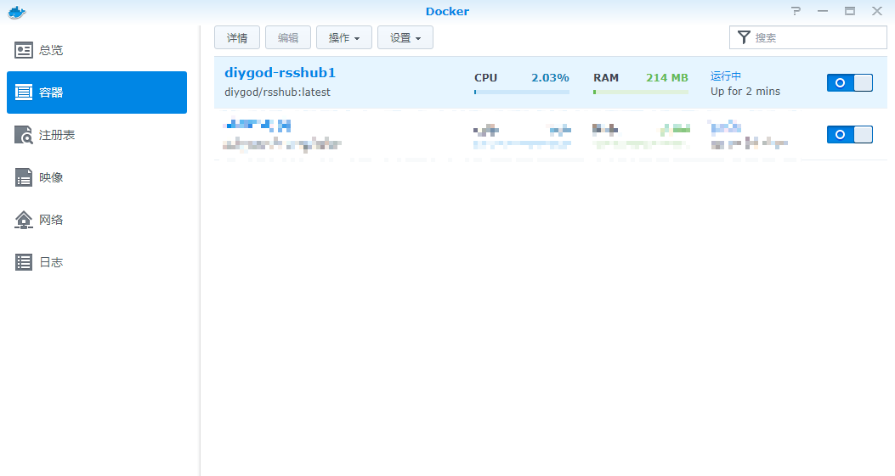

7. 浏览器输入 {群晖域名}:{刚设置的端口}，如下图所示则 RSSHub 运行正常。

   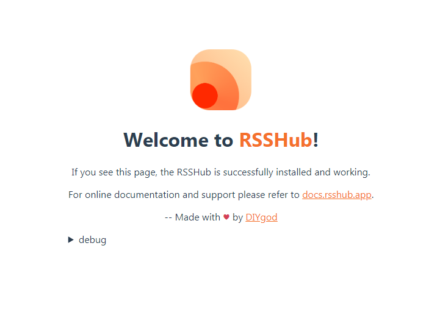

## 获取字幕组链接

虽然字幕组本身提供提供了 RSS 功能，但是在群晖中一直无法正常识别。

RSSHub 的文档也有提及这一点：

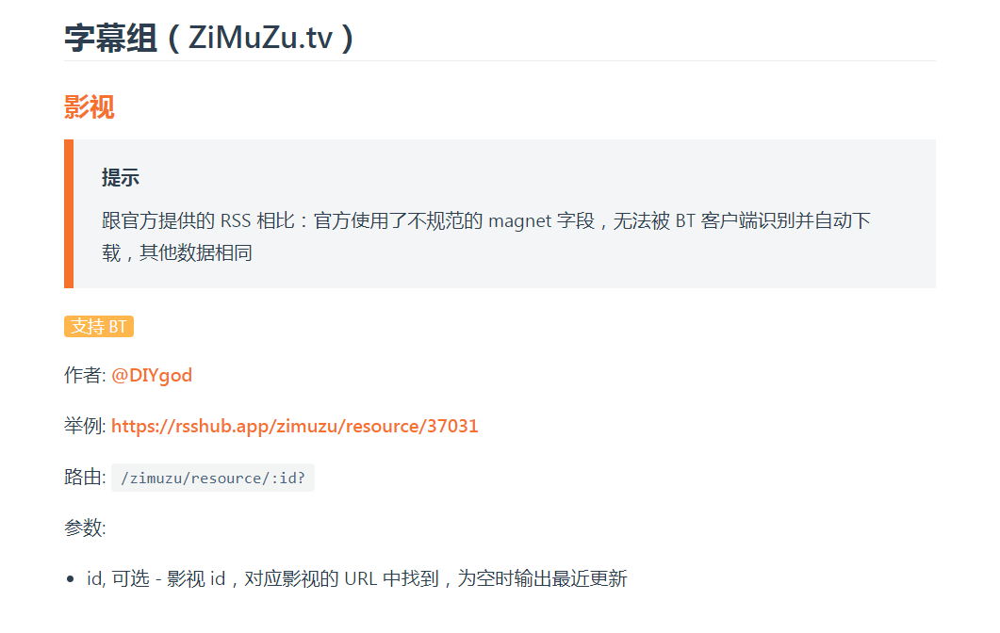

以刚完结不久的《神盾局特工》为例，网址最后的数字便是我们需要的id。

> http://www.rrys2020.com/resource/30675

打开 Download Station-> RSS Feeds，选择加入。

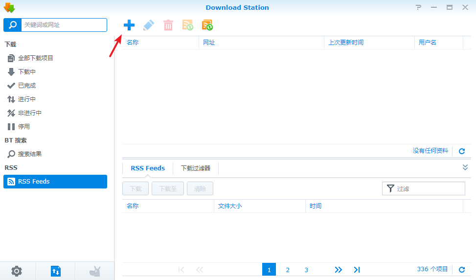

格式如下：

> http://{群晖域名}:{端口}/zimuzu/resource/30675

可以在网址最后以?开头加上需要的参数，这里选用的是`filter_title`，作用是根据标题过滤出想要的剧集。

其他参数请参考：https://docs.rsshub.app/parameter.html

选中“自动下载所有项目”并指定目的地文件夹，便于今后的自动追剧。

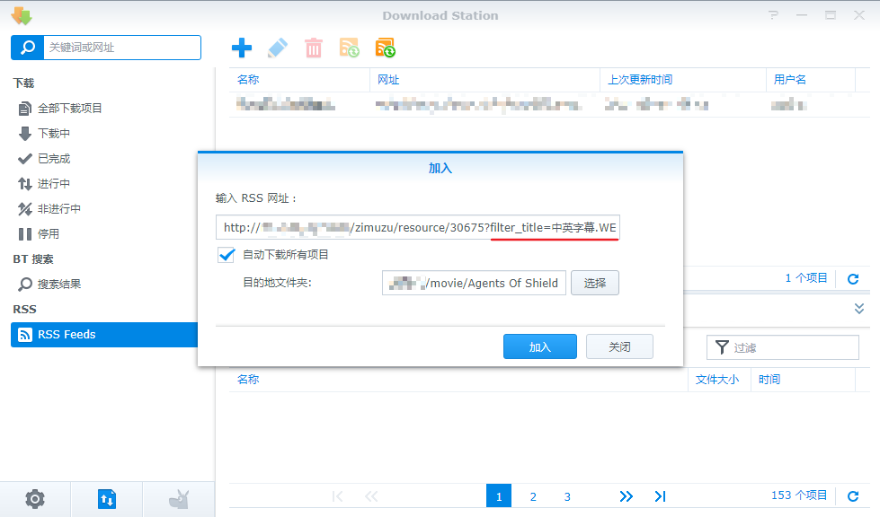

加入完成后，可以在 RSS Feeds 中看到对应的剧集。

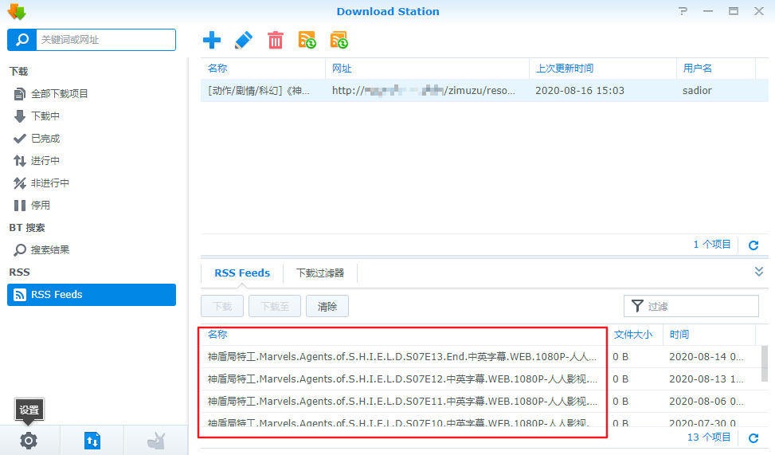

RSS 默认的更新间隔时间是24小时，可以根据需求自行在左下角的设置->RSS 中进行修改。

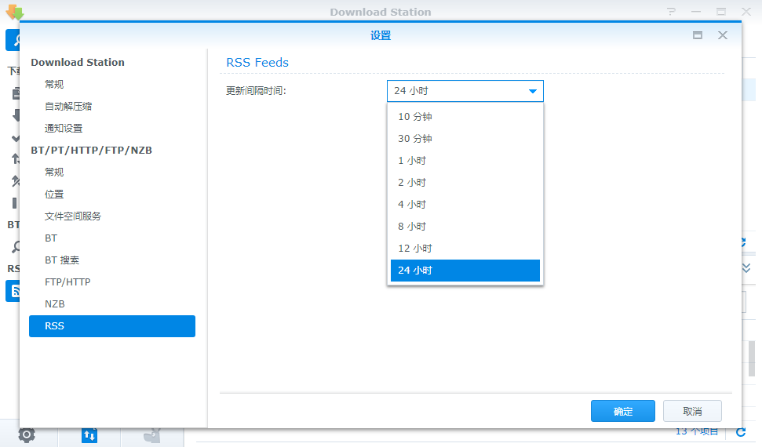

