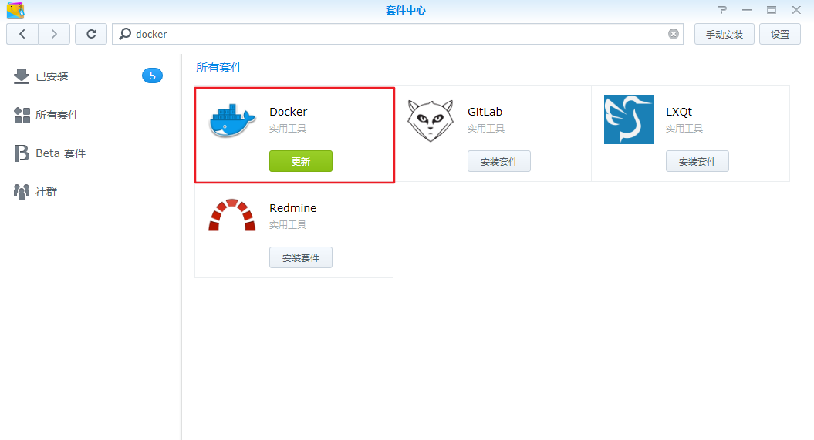
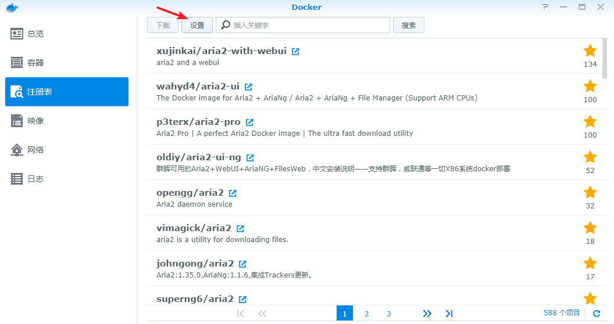
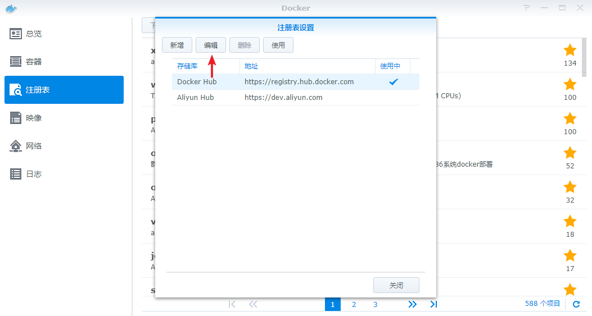
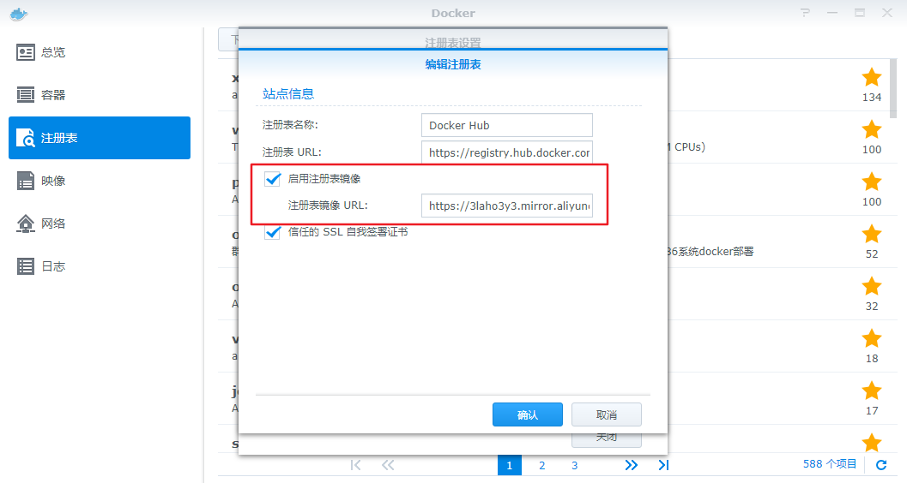

# 安装Docker

套件中心搜索Docker

# 启用国内镜像加速

Docker->注册表->设置->编辑

勾选启用注册表镜像，输入镜像源地址

国内的镜像源地址（选择其一）：

https://registry.docker-cn.com
http://hub-mirror.c.163.com
https://3laho3y3.mirror.aliyuncs.com
http://f1361db2.m.daocloud.io
https://mirror.ccs.tencentyun.com

确认后等待重启