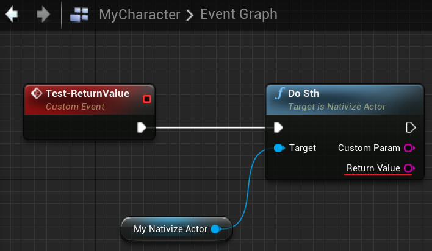
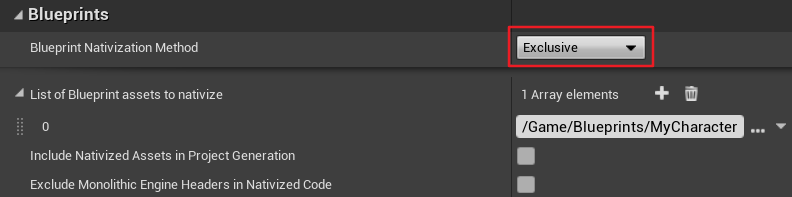

# ReturnValue

## Summary

如果函数返回值被命名为 `ReturnValue` ，且含有该函数的 Blueprint 未被 `Nativize` 而调用该函数的 Blueprint 被 `Nativize` ，则会出现函数调用参数不符合的编译错误。

版本：4.25.3

## Reproduce

新建 Blueprint —— `NativizeActor`。


新建函数，在函数中声明一个输出变量——`ReturnValue`。（同时声明一个 `CustomParam` 用于对比）


新建 Blueprint ——`MyCharacter`，声明一个`NativizeActor`类型的变量，并调用该变量提供的函数 `DoSth`。



保存修改，打开 Project Settings ，在 Packaging 页中将 Blueprint Nativization Method 的选项设为 `Exclusive`，并只添加 `MyCharacter` 到 Nativize 列表。



进行 Cook，在子目录[Intermediate\Plugins\NativizedAssets\Windows\Game\Source\NativizedAssets]() 中会生成 Nativize 之后的代码。

从生成的代码中发现，`MyCharacter` 在调用 `NativizeActor` 的 `DoSth` 时，由 `ReturnValue` 生成的变量 `bpfv__CallFunc_DoSth_ReturnValue__pf` 作为返回值被放在了等式的左边，用于对比的 `CustomParam` 则作为引用参数被传进该函数。

```c++
// MyCharacter__pf2132744816.cpp
void AMyCharacter_C__pf2132744816::bpf__ExecuteUbergraph_MyCharacter__pf_0(int32 bpp__EntryPoint__pf)
{
	FString bpfv__CallFunc_DoSth_ReturnValue__pf{};
	check(bpp__EntryPoint__pf == 2);
	// optimized KCST_UnconditionalGoto
	if(::IsValid(bpv__MyNativizeActor__pf))
	{
		bpfv__CallFunc_DoSth_ReturnValue__pf = FUnconvertedWrapper__ANativizeActor_C__pf2132744816(bpv__MyNativizeActor__pf).bpf__DoSth__pf(/*out*/ b0l__CallFunc_DoSth_CustomParam__pf);
	}
	return; // KCST_GotoReturn
}
void AMyCharacter_C__pf2132744816::bpf__TestxReturnValue__pfG()
{
	bpf__ExecuteUbergraph_MyCharacter__pf_0(2);
}
```

由于 `NativizeActor` 本身并未被选择为 Nativize 的对象，所以只会生成作为中间传递 Wrapper 的头文件。不难发现，`DoSth` 的返回类型在该头文件下为 void，`ReturnValue` 也是作为引用参数被传入。而这也是导致代码编译时两边不匹配继而出错的原因。

```c++
// NativizeActor__pf2132744816.h
struct FUnconvertedWrapper__ANativizeActor_C__pf2132744816 : public FUnconvertedWrapper<AActor>
{
	FUnconvertedWrapper__ANativizeActor_C__pf2132744816(const AActor* __InObject) : FUnconvertedWrapper<AActor>(__InObject){}
	FORCENOINLINE USceneComponent* & GetRef__DefaultSceneRoot__pf()
	{
		static TWeakFieldPtr<const FProperty> __PropertyPtr{};
		const FProperty* __Property = __PropertyPtr.Get();
		if (nullptr == __Property)
		{
			__Property = GetClass()->FindPropertyByName(FName(TEXT("DefaultSceneRoot")));
			check(__Property);
			__PropertyPtr = __Property;
		}
		return *(__Property->ContainerPtrToValuePtr<USceneComponent* >(__Object));
	}
	FORCENOINLINE void bpf__DoSth__pf(/*out*/ FString& bpp__CustomParam__pf, /*out*/ FString& bpp__ReturnValue__pf)
	{
		static const FName __FunctionName(TEXT("DoSth"));
		UFunction* __Function = __Object->FindFunctionChecked(__FunctionName);
		struct bpf__DoSth__pf_Parameters
		{
			FString bpp__CustomParam__pf_;
			FString bpp__ReturnValue__pf_;
		};
		bpf__DoSth__pf_Parameters __Parameters { bpp__CustomParam__pf, bpp__ReturnValue__pf };
		__Object->ProcessEvent(__Function, &__Parameters);
	}
};
```


## Cause

在 UE 代码中，如果参数为 `ReturnValue`，该参数会被标记为 `CPF_ReturnParm` ，这个标记也决定了参数在最终生成的表达式中所处的位置。

```c++
// Engine\Source\Editor\Kismet\Private\BlueprintCompilationManager.cpp
// FastGenerateSkeletonClass
------
// Gather all input pins on these nodes, these are 
// the outputs of the function:
TSet<FName> UsedPinNames;
static const FName RetValName = FName(TEXT("ReturnValue"));
for(UK2Node_FunctionResult* Node : ReturnNodes)
{
    for(UEdGraphPin* Pin : Node->Pins)
    {
        if(!Schema->IsExecPin(*Pin) && Pin->ParentPin == nullptr)
        {								
            if(!UsedPinNames.Contains(Pin->PinName))
            {
                UsedPinNames.Add(Pin->PinName);

                FProperty* Param = FKismetCompilerUtilities::CreatePropertyOnScope(NewFunction, Pin->PinName, Pin->PinType, Ret, CPF_None, Schema, MessageLog);
                if(Param)
                {
                    Param->SetFlags(RF_Transient);
                    // we only tag things as CPF_ReturnParm if the value is named ReturnValue.... this is *terrible* behavior:
                    if(Param->GetFName() == RetValName)
                    {
                        Param->PropertyFlags |= CPF_ReturnParm;
                    }
                    Param->PropertyFlags |= CPF_Parm|CPF_OutParm;
                    *InCurrentParamStorageLocation = Param;
                    InCurrentParamStorageLocation = &Param->Next;
                }
            }
        }
    }
}
```

```c++
// Engine\Source\Editor\KismetCompiler\Private\KismetCompiler.cpp
// CreateLocalVariablesForFunction
------
// Fix up the return value
//@todo:  Is there a better way of doing this without mangling code?
const FName RetValName = FName(TEXT("ReturnValue"));
for (TFieldIterator<FProperty> It(Context.Function); It && (It->PropertyFlags & CPF_Parm); ++It)
{
    FProperty* Property = *It;
    if ((Property->GetFName() == RetValName) && Property->HasAnyPropertyFlags(CPF_OutParm))
    {
        Property->SetPropertyFlags(CPF_ReturnParm);
    }
}
------
// PrecompileFunction
------
// Fix up the return value - this used to be done by CreateLocalVariablesForFunction.
// This should probably be done in CreateParametersForFunction
const FName RetValName = FName(TEXT("ReturnValue"));
for (TFieldIterator<FProperty> It(Context.Function); It && (It->PropertyFlags & CPF_Parm); ++It)
{
    FProperty* Property = *It;
    if ((Property->GetFName() == RetValName) && Property->HasAnyPropertyFlags(CPF_OutParm))
    {
        Property->SetPropertyFlags(CPF_ReturnParm);
    }
}
```


## Solution

1. 在自定义函数中，避免使用 `ReturnValue` 命名函数返回值。（推荐）
2. 将含有以 `ReturnValue` 命名函数返回值的 Blueprint 也添加进 Nativize 列表。

Nativize 后的 `NativizeActor` 如下所示。`ReturnValue` 会作为返回值被返回，与外部调用相匹配。

```c++
FString  ANativizeActor_C__pf2132744816::bpf__DoSth__pf(/*out*/ FString& bpp__CustomParam__pf)
{
	FString bpp__ReturnValue__pf{};
	bpp__CustomParam__pf = FString(TEXT(""));
	bpp__ReturnValue__pf = FString(TEXT(""));
	return bpp__ReturnValue__pf;
}
```

